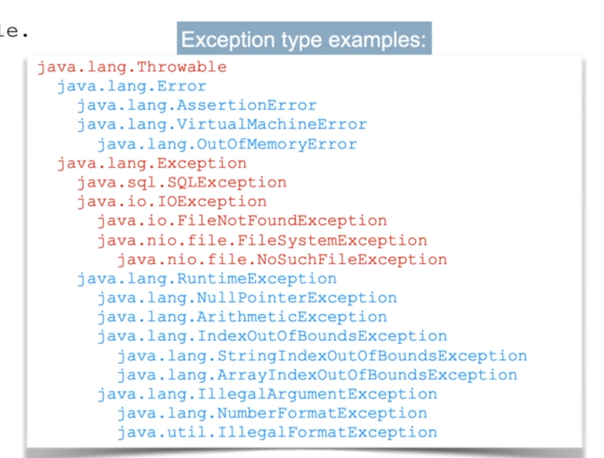

    # Exceptions
## Overview

### What to catch when try catch is empty
```java
  void catchError() {
    try {

    }catch (Error e) {}
    }
```

```java
  void catchException() {
    try {

    }catch (Exception e) {}
    }
```

```java
  void catchThrowable() {
    try {

    }catch (Throwable e) {}
    }
```

```java
  void catchRTE() {
    try {

    }catch (RuntimeException e) {}
    }
```

```java
  //Exception 'java.io.IOException' is never thrown in the corresponding try block
 void catchCustomCheckedException() {  
    try {

    }catch (IOException e) {}  //DOES NOT COMPILE!  
  }
```
```java
// Compiles
try{
    
        }
catch (ArithmeticException | NullPointerException e){

  }
```
```java
// Does Not Compiles
//Types in multi-catch must be disjoint: 'java.lang.ArithmeticException' is a subclass of 'java.lang.Exception'
try{
    
        }
catch (ArithmeticException | Exceprtion e){

  }
```
[CatchExceptions](../src/main/java/org/enricogiurin/ocp17/book/ch11/exceptions/CatchMethodWithThrows.java)


### Throws
A method can declare an exception even if it's not thrown within the method itself.
```java
  void throwsRuntimeException() throws RuntimeException {
    throwingNothing();
  }
  void throwingNothing() {}
```
[throws Exceptions](../src/main/java/org/enricogiurin/ocp17/book/ch11/exceptions/ThrowsExceptionNotThrown.java)


### Error Classes
| Error              | Description              | 
|:-------------------|:-------------------------|
| ExceptionInInitializerError              | Thrown when static initializer throws exception and doesn’t handle it |
| StackOverflowError | Thrown when method calls itself too many times (called infinite recursion because method typically calls itself without end)              |
| NoClassDefFoundError | Thrown when class that code uses is available at com- pile time but not runtime              |

### Some Runtime Exception
```java
public class NumberFormatException extends IllegalArgumentException {/**/}
```

## try with resources
Variables declared in the try block should be either **final** or **effectively final**. 
```java
var bf = Files.newBufferedWriter(path);
try (bf) { // DOES NOT COMPILE
    bf.append("Welcome to the zoo!");
 } 
bf = null;  //here I re-assign the variable used in the try block
```
### Closable & AutoClosable
```java
package java.io;
public interface Closeable extends AutoCloseable {
void close() throws IOException;
}
```

```java
package java.lang;
public interface AutoCloseable {
  void close() throws Exception;
}
```
Note that `AutoCloseable` is in the `java.lang` package, import it's not needed.

`AutoCloseable` is a more general-purpose interface and can be used for any resource that needs to be closed, 
not necessarily related to I/O.


## -g:vars
[NullPointerException with -g:vars](../src/main/java/org/enricogiurin/ocp17/book/ch11/exceptions/NullPointerExceptionGVars.java)