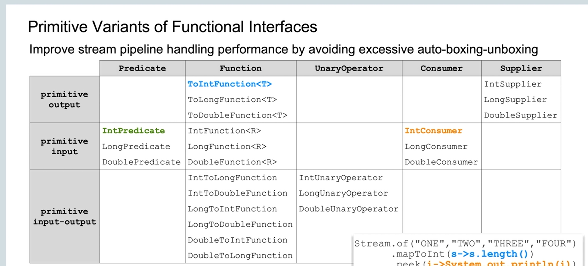

# Lambdas and Functional Interfaces

## Lambda
### Lambda & var - I can't assign a lambda to a var
**I can't assign a lambda to a var!!!!**  
**I can't assign a lambda to a var!!!!**  
**I can't assign a lambda to a var!!!!**  
```java
//  Error:
//  cannot infer type for local variable lambda
//  (lambda expression needs an explicit target-type)
var lambda=s->s+2;  //does not compile
```
Same with MR
```java
// cannot infer type for local variable consumer
//    (method reference needs an explicit target-type)
var consumer = System.out::print; //does not compile
```
### Using var in lambda
```java
Predicate<String> pred3 = (final var s) -> s.isEmpty();
Predicate<String> pred5 = (var s) -> s.isEmpty();
//Predicate<String> pred2 = (final s) -> s.isEmpty();  //does NOT compile!
```

I cannot mix var with type in the same lambda"
```java
//Cannot mix 'var' and explicitly typed parameters in lambda expression
Comparator<String> c = (var s1, String s2) -> 0;  //does not compile!
```
[Using var in lambda](../src/main/java/org/enricogiurin/ocp17/book/ch8/lambda/UsageOfVarInLambda.java)

### Lambda boxing
```java
//does not compile
Function<Integer, Boolean> function = (int i) -> {return false;}
```
The type is `Integer` in the Function and `int` in the lambda.

### Lambda and variables effective final
Lambdas require **local variables** and **method parameters** to be effectively final to use them.
Instance and static variables can be used regardless of whether they are effectively final.

[LambdaEffectiveFinal](../src/main/java/org/enricogiurin/ocp17/book/ch8/lambda/LambdaEffectiveFinal.java)
#### Rules
When using lambda expressions that access instance variables, local variables, or parameters:
* local variables **must be** effective final
* parameters **must be** effective final
* instance variables **are not subject** to the effective final constraint.

### Deferred execution
Deferred execution means the lambda expression is not evaluated until runtime, but it is compiled.  
In the context of lambdas in Java, deferred execution refers to the delayed execution of the code encapsulated within the lambda expression.

## Method Reference
The same Method Reference, `ArrayList::new`, can be applied to different FunctionalInterface:
* `Function<Integer, List<Integer>>`
* `Supplier<List<Integer>> supplier`
```java
Function<Integer, List<Integer>> create = n->new ArrayList<>(n);
Function<Integer, List<Integer>> createMR = ArrayList::new;

List<Integer> list = createMR.apply(10);

//but we can also avoid passing the initial capacity, then in this case it's a Supplier
Supplier<List<Integer>> supplier = ArrayList::new;
```

## Functional Interfaces
### Consumer
[Consumer](../src/main/java/org/enricogiurin/ocp17/book/ch8/functionalinterface/jdk/UsageOfConsumer.java)
#### andThen
```java
Consumer<String> c1 = s -> System.out.print(s+" ");
Consumer<String> c2 = s -> System.out.println(s.length());
Consumer<String> all = c1.andThen(c2);
all.accept("hello"); //hello 5
```


### Object Methods
If a functional interface includes an abstract method with
the same signature as a public method found in `Object`, those methods do not count toward the single
abstract method test.
[Functional Interfaces](../src/main/java/org/enricogiurin/ocp17/book/ch8/functionalinterface/UsageOfFunctionalInterface.java)

### Main Functional Interfaces (generated by ChatGPT)
| Functional Interface | Method                   |
|----------------------|--------------------------|
| `Predicate<T>`       | `boolean test(T t)`      |
| `Consumer<T>`        | `void accept(T t)`       |
| `Function<T, R>`     | `R apply(T t)`           |
| `Supplier<T>`        | `T get()`                |
| `UnaryOperator<T>`    | `T apply(T t)`           |
| `BinaryOperator<T>`   | `T apply(T t1, T t2)`    |
| `BiPredicate<T, U>`   | `boolean test(T t, U u)` |
| `BiConsumer<T, U>`    | `void accept(T t, U u)`  |
| `BiFunction<T, U, R>` | `R apply(T t, U u)`      |

### built-in functional interfaces.
#### With obj
Object is abbreviated to `Obj` in the built-in functional interfaces.

Some from the `java.util.function` package:
- `ObjIntConsumer<T>`
- `ObjDoubleConsumer<T>`
- `ObjLongConsumer<T>`


### Functional Interfaces for Primitives
#### Primitive Variants of Functional Interface


#### BooleanSupplier & others
```java
BooleanSupplier bs = () -> Math.random() >= 0.5;
boolean result = bs.bs.getAsBoolean();
```
It's _getAsBoolean()_ **NOT** get()

Similarly, we have:
- `IntSupplier`: `getAsInt()`
- `LongSupplier`: `getAsLong()`
- `DoubleSupplier`: `getAsDouble()`

#### IntUnaryOperator
Note: this FI does not have generics!
```java
//note that this FI does not have generics
IntUnaryOperator intUnaryOperator = n -> n * 2;
int result = intUnaryOperator.applyAsInt(10);
System.out.println(result);
```

#### XtoYFunction
IntToLongFunction
```java
IntToLongFunction intToLongFunction = (int n)->Long.MAX_VALUE;
long result = intToLongFunction.applyAsLong(5);
```
In general is:
 - primitive type per X
 - applyAsY(x)

### Function
#### Compose
```java
//javadoc
default<V> Function<V, R> compose(Function<? super V,?extends T>before)
```

_Returns a composed function that first applies the **before** function to its input, and then
applies this function to the result.
If evaluation of either function throws an exception, it is relayed to the caller of the composed
function._

```java
Function<Integer, Integer> after=a->a+4;
Function<Integer, Integer> before=a->a*3;
Function<Integer, Integer> compose=after.compose(before);
System.out.print(compose.apply(2));  // (2*3) + 4 = 10
```